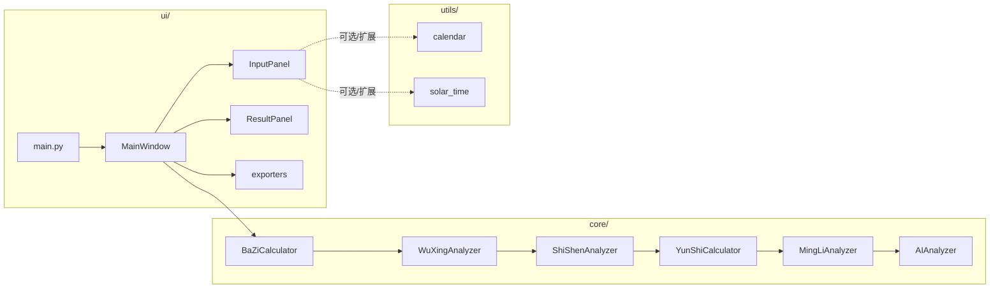

# KP-AI-FENGSHUI Code Wiki

## 1. 项目概览

本仓库是一个基于 PyQt5 的桌面“八字排盘”应用，提供以下能力：

- 输入出生信息（公历/农历、时辰、性别等）
- 生成四柱八字（年/月/日/时干支）
- 进行五行统计、十神分析、大运计算、扩展命理要素汇总
- 通过星火（Spark）对话接口生成 AI 文本分析（失败时自动降级为本地规则分析）
- 将排盘结果导出为 CSV / Excel / PDF（部分格式需要可选依赖）

运行入口为 [main.py](file:///d:/PythonProject/KP-AI-FENGSHUI/main.py#L1-L9)，启动后打开主窗口 [MainWindow](file:///d:/PythonProject/KP-AI-FENGSHUI/ui/main_window.py#L20-L372)。

## 2. 快速开始（运行方式）

### 2.1 环境准备

- Python 3.10+（仓库中出现 CPython 3.12/3.13 的缓存文件，建议至少 3.10，推荐 3.12）
- Windows / macOS / Linux 均可，但 UI 依赖 PyQt5

安装依赖（建议使用独立虚拟环境，不要依赖仓库内的 `test_env/`）：

```bash
python -m venv .venv
.venv\Scripts\activate
pip install -r requirements.txt
pip install requests
```

说明：

- `requirements.txt` 只声明了 `PyQt5` 和 `lunarcalendar`：[requirements.txt](file:///d:/PythonProject/KP-AI-FENGSHUI/requirements.txt#L1-L2)
- AI 调用依赖 `requests`，但未写入 requirements（见 [ai_analyzer.py](file:///d:/PythonProject/KP-AI-FENGSHUI/core/ai_analyzer.py#L1-L7)）

### 2.2 启动应用

```bash
python main.py
```

### 2.3 启用导出（可选）

- Excel 导出：`pip install openpyxl`
- PDF 导出：`pip install reportlab`

CSV 导出无需额外依赖。

## 3. 仓库结构

```
KP-AI-FENGSHUI/
  main.py
  requirements.txt
  core/                 # 命理核心计算与 AI 分析
  ui/                   # PyQt5 GUI（输入、展示、导出）
  utils/                # 日历/真太阳时/节气等通用工具
  spark_api_reference.py# 星火流式接口参考脚本
  test_env/             # 随仓库附带的虚拟环境/三方包（不建议纳入版本库/不作为源码分析对象）
```

核心业务源码主要集中在：

- [core/](file:///d:/PythonProject/KP-AI-FENGSHUI/core)
- [ui/](file:///d:/PythonProject/KP-AI-FENGSHUI/ui)
- [utils/](file:///d:/PythonProject/KP-AI-FENGSHUI/utils)

## 4. 架构与数据流

### 4.1 分层视角

- UI 层：负责采集用户输入、编排调用链、渲染结果、导出文件
- Domain 层（core）：提供命理相关计算与分析能力（纯 Python 逻辑）
- Infra/Utils 层（utils）：提供历法转换、真太阳时/节气计算等基础能力
- 外部依赖：
  - `lunarcalendar`：农历/公历转换
  - Spark API（HTTP）：AI 分析文本生成

### 4.2 主调用链（从点击“精准排盘”开始）

入口：`MainWindow.on_calculate()` → `MainWindow.perform_calculate()`  
实现见 [main_window.py](file:///d:/PythonProject/KP-AI-FENGSHUI/ui/main_window.py#L207-L289)。

主要步骤（按执行顺序）：

1. 从 [InputPanel.get_data](file:///d:/PythonProject/KP-AI-FENGSHUI/ui/components/input_panel.py#L577-L604) 获取输入数据
2. 四柱计算：`BaZiCalculator.calculate(...)` → 生成 `bazhi` 字典
3. 五行分析：`WuXingAnalyzer.analyze(bazhi)`
4. 十神分析：`ShiShenAnalyzer.analyze(bazhi)`
5. 大运计算：`YunShiCalculator.calculate_major_fortune(bazhi, gender, birth_year)`
6. 扩展命理汇总：`MingLiAnalyzer.analyze_all(bazhi)`
7. AI 分析：`AIAnalyzer.analyze(bazhi, wuxing_result, shishen_result, mingli_result)`（优先 API，失败降级本地）
8. UI 渲染：`ResultPanel.update_*` 系列方法

### 4.3 组件关系图（Mermaid）



备注：

- 当前实际入口 UI 为 `MainWindow + InputPanel + ResultPanel`
- [home_page.py](file:///d:/PythonProject/KP-AI-FENGSHUI/ui/components/home_page.py) 引用了 `utils.calendar/utils.solar_time` 并包含更完整的“节气/真太阳时提示”交互，但从入口与主窗口实现看未接入（且其样式常量命名与当前 [styles.py](file:///d:/PythonProject/KP-AI-FENGSHUI/ui/styles.py) 不完全一致，可能是未完成/旧版本页面）

## 5. 核心数据模型（关键字典结构）

本项目的“数据协议”主要以 Python `dict` 作为模块间传递载体，典型结构如下。

### 5.1 `bazhi`（四柱结果）

由 [BaZiCalculator.calculate](file:///d:/PythonProject/KP-AI-FENGSHUI/core/baazi.py#L114-L141) 返回：

- `solar_date`: `"YYYY-M-D"`
- `lunar_date`: `"YYYY年M月D日"`
- `year/month/day/hour`: 对应四柱干支字符串，如 `"甲子"`
- `rizhu`: 日主天干（`day[0]`）
- `四柱`: `["年柱干支", "月柱干支", "日柱干支", "时柱干支"]`

### 5.2 `wuxing_result`（五行统计）

由 [WuXingAnalyzer.analyze](file:///d:/PythonProject/KP-AI-FENGSHUI/core/wuxing.py#L30-L80) 返回：

- 五行键：`木/火/土/金/水`，每个包含 `count/percentage/elements`
- `summary`: 汇总描述（如“木偏旺，水偏弱”等）

### 5.3 `shishen_result`（十神分析）

由 [ShiShenAnalyzer.analyze](file:///d:/PythonProject/KP-AI-FENGSHUI/core/shishen.py#L57-L91) 返回：

- `rizhu`: 日主天干
- `rizhu_wuxing`: 日主五行
- `details`: 逐柱明细（年/月/日/时），包含 `gan_shishen` 与 `zhi_shishens`
- `summary`: 十神统计（以“十神名 → 个数”表示）

### 5.4 `major_fortune`（大运）

由 [YunShiCalculator.calculate_major_fortune](file:///d:/PythonProject/KP-AI-FENGSHUI/core/yunshi.py#L80-L124) 返回：

- `direction`: `顺行/逆行`
- `periods`: 1~9 步大运列表，每步含 `ganzhi/start_age/end_age/start_year/end_year/analysis`

### 5.5 `mingli_result`（扩展命理汇总）

由 [MingLiAnalyzer.analyze_all](file:///d:/PythonProject/KP-AI-FENGSHUI/core/mingli.py#L436-L445) 返回，包含：

- 藏干分析、纳音、神煞、主星、干支关系、自坐、空亡

### 5.6 `ai_analysis`（AI 智能解析）

由 [AIAnalyzer.analyze](file:///d:/PythonProject/KP-AI-FENGSHUI/core/ai_analyzer.py#L78-L102) 返回的目标结构为：

- `personality/career/marriage/health/suggestions`: 每项为字符串数组

当 API 返回非 JSON 或 API 失败时会进行文本解析或降级（见 [AIAnalyzer._parse_text_response](file:///d:/PythonProject/KP-AI-FENGSHUI/core/ai_analyzer.py#L271-L310) 与 [AIAnalyzer._analyze_locally](file:///d:/PythonProject/KP-AI-FENGSHUI/core/ai_analyzer.py#L323-L336)）。

## 6. 模块详解

### 6.1 core/（命理核心）

#### 6.1.1 baazi.py：四柱排盘

- 常量：天干/地支/六十甲子/月干表等
- 核心类：[BaZiCalculator](file:///d:/PythonProject/KP-AI-FENGSHUI/core/baazi.py#L28-L147)
  - `calculate(year, month, day, hour, is_lunar=False)`：生成四柱与日期信息
  - `get_year_ganzhi/get_month_ganzhi/get_day_ganzhi/get_hour_ganzhi`：分项推导干支

依赖：`lunarcalendar.Converter/Solar/Lunar` 用于农历与公历互转（见 [baazi.py](file:///d:/PythonProject/KP-AI-FENGSHUI/core/baazi.py#L1-L141)）。

#### 6.1.2 wuxing.py：五行统计

- 数据表：天干/地支五行映射、地支藏干映射
- 核心类：[WuXingAnalyzer](file:///d:/PythonProject/KP-AI-FENGSHUI/core/wuxing.py#L30-L80)
  - `analyze(bazhi)`：统计天干、地支、藏干的五行占比（藏干按 0.5 权重）
  - `get_summary(data)`：输出“旺/弱/均衡”描述

#### 6.1.3 shishen.py：十神分析

- 数据表：十神类型映射 `SHISHEN_MAP/SHISHEN_DETAIL`
- 核心类：[ShiShenAnalyzer](file:///d:/PythonProject/KP-AI-FENGSHUI/core/shishen.py#L19-L129)
  - `get_shishen_type/get_shishen_name`：以天干序差推导“正印/偏印/正官/七杀/正财/偏财/食神/伤官/比肩/劫财”等
  - `analyze(bazhi)`：输出逐柱十神明细与统计汇总

#### 6.1.4 yunshi.py：大运/流年（月运方法也已实现）

- 数据表：天干/地支运势文本模板（`YUNSHI_ANALYSIS/ZHI_ANALYSIS`）
- 核心类：[YunShiCalculator](file:///d:/PythonProject/KP-AI-FENGSHUI/core/yunshi.py#L61-L242)
  - `calculate_major_fortune(bazhi, gender, birth_year)`：根据性别与日干阴阳判断顺逆行，并生成 9 步大运
  - `calculate_annual_fortune(bazhi, start_year=2024, years_count=10)`：流年（当前 UI 未接入）
  - `calculate_monthly_fortune(bazhi, target_year=None)`：月运（当前 UI 未接入）

#### 6.1.5 mingli.py：扩展命理要素

该文件维护了多个命理数据表（纳音、神煞、主星、干支关系、空亡表等），并以 [MingLiAnalyzer](file:///d:/PythonProject/KP-AI-FENGSHUI/core/mingli.py#L209-L445) 封装为可调用接口：

- `analyze_hidden_stems/analyze_nayin/analyze_shensha/...`：分项分析
- `analyze_all(bazhi)`：汇总输出供 UI 与 AI 使用

#### 6.1.6 ai_analyzer.py：AI 智能解析（API + 本地降级）

核心类：[AIAnalyzer](file:///d:/PythonProject/KP-AI-FENGSHUI/core/ai_analyzer.py#L78-L438)

- `analyze(...)`：主入口，优先 API；异常时降级为本地规则分析
- `_analyze_via_api(...)`：流式接收 Spark 响应，尝试将完整内容解析为 JSON；失败则走文本解析
- `_analyze_locally(...)`：以日主五行、五行强弱与十神分布组合出基本建议

重要说明：

- AI 调用依赖 `requests`（目前未在 requirements 声明）
- 该模块存在“证书校验关闭/忽略警告”的实现细节，建议在生产环境开启证书验证并使用更安全的配置方式
- API 凭证建议通过环境变量或配置文件注入，而不是写入源码常量

### 6.2 ui/（桌面界面）

#### 6.2.1 main_window.py：应用主窗口与业务编排

核心类：[MainWindow](file:///d:/PythonProject/KP-AI-FENGSHUI/ui/main_window.py#L20-L372)

- `init_ui()`：搭建布局（左侧输入、右侧结果、底部状态/进度）
- `init_analyzers()`：初始化 core 侧计算器与分析器实例（见 [main_window.py](file:///d:/PythonProject/KP-AI-FENGSHUI/ui/main_window.py#L177-L184)）
- `perform_calculate()`：串联 core 侧调用链（见 [main_window.py](file:///d:/PythonProject/KP-AI-FENGSHUI/ui/main_window.py#L217-L253)）
- `update_results(...)`：驱动 ResultPanel 刷新并缓存 `current_data`（见 [main_window.py](file:///d:/PythonProject/KP-AI-FENGSHUI/ui/main_window.py#L262-L289)）
- `on_export(format_type)`：按格式选择 exporter 并导出（见 [main_window.py](file:///d:/PythonProject/KP-AI-FENGSHUI/ui/main_window.py#L291-L324)）

#### 6.2.2 components/input_panel.py：输入面板（当前主入口使用）

核心类：[InputPanel](file:///d:/PythonProject/KP-AI-FENGSHUI/ui/components/input_panel.py#L34-L640)

- 采集：姓名、性别、历法（公历/农历）、出生日期、出生时分、出生地经纬度、高级设置等
- 校验：`validate_input()` 控制“精准排盘”按钮可用性（见 [input_panel.py](file:///d:/PythonProject/KP-AI-FENGSHUI/ui/components/input_panel.py#L534-L571)）
- 输出：`get_data()` 返回主窗口使用的输入字典（见 [input_panel.py](file:///d:/PythonProject/KP-AI-FENGSHUI/ui/components/input_panel.py#L577-L604)）

注意：InputPanel 已包含“真太阳时/起运规则/闰月规则”等高级设置 UI 字段，但目前 `MainWindow.perform_calculate()` 并未消费这些字段（属于“预留字段/待接入能力”）。

#### 6.2.3 components/result_panel.py：结果面板

核心类：[ResultPanel](file:///d:/PythonProject/KP-AI-FENGSHUI/ui/components/result_panel.py#L476-L542)

由多个卡片组成：

- `BasicInfoCard`：基础信息展示
- `BaziCard`：四柱/十神/藏干/五行速览
- `WuxingCard`：五行占比与摘要
- `FortuneCard`：大运表格
- `AIAnalysisCard`：AI 分析五大段落

刷新入口在 `ResultPanel.update_*` 系列方法，供 [MainWindow.update_results](file:///d:/PythonProject/KP-AI-FENGSHUI/ui/main_window.py#L262-L289) 调用。

#### 6.2.4 export/：导出能力

- 工厂：`get_exporter(format_type)`：[ui/export/__init__.py](file:///d:/PythonProject/KP-AI-FENGSHUI/ui/export/__init__.py#L1-L15)
- 抽象基类：[BaseExporter](file:///d:/PythonProject/KP-AI-FENGSHUI/ui/export/base_exporter.py#L1-L70)
  - `export(data, file_path)`：校验数据并调用 `perform_export`
  - `get_basic_info/get_bazi_data/get_wuxing_data/get_shishen_data`：统一导出数据访问接口
- CSV：[CsvExporter](file:///d:/PythonProject/KP-AI-FENGSHUI/ui/export/csv_exporter.py#L1-L57)
- Excel：[ExcelExporter](file:///d:/PythonProject/KP-AI-FENGSHUI/ui/export/excel_exporter.py#L1-L259)（依赖 openpyxl）
- PDF：[PdfExporter](file:///d:/PythonProject/KP-AI-FENGSHUI/ui/export/pdf_exporter.py#L1-L213)（依赖 reportlab）

#### 6.2.5 styles.py：统一样式

集中定义颜色/字体/间距与 PyQt5 样式字符串：[styles.py](file:///d:/PythonProject/KP-AI-FENGSHUI/ui/styles.py#L1-L457)

### 6.3 utils/（工具层）

#### 6.3.1 calendar.py：历法转换

- `solar_to_lunar(...)` / `lunar_to_solar(...)`：公历/农历互转（依赖 lunarcalendar）
- `get_ganzhi(...)`：获取年/月/日干支（见 [calendar.py](file:///d:/PythonProject/KP-AI-FENGSHUI/utils/calendar.py#L6-L41)）

#### 6.3.2 solar_time.py：真太阳时与节气估算

提供城市经纬度表、儒略日换算、时间差估算、节气信息估算等：

- `calculate_true_solar_time(...)`：根据经度与方程时差估算真太阳时校正
- `get_solar_term_info(...)`：估算当前节气、下一节气与“月令”提示

实现见 [solar_time.py](file:///d:/PythonProject/KP-AI-FENGSHUI/utils/solar_time.py#L1-L185)。

## 7. 依赖关系与可选特性

### 7.1 必需依赖

- PyQt5：GUI（requirements 已声明）
- lunarcalendar：农历/公历换算（requirements 已声明）
- requests：AI HTTP 调用（源码使用但 requirements 未声明）

### 7.2 可选依赖（导出）

- openpyxl：Excel 导出
- reportlab：PDF 导出

### 7.3 运行时外部服务

- Spark API（星火）对话接口：用于 AI 分析
  - 仓库附带了参考脚本 [spark_api_reference.py](file:///d:/PythonProject/KP-AI-FENGSHUI/spark_api_reference.py#L1-L98)
  - AIAnalyzer 内部亦实现了流式接收与解析逻辑

## 8. 关键类与函数索引（按功能）

### 8.1 排盘与基础命理

- 四柱排盘：`BaZiCalculator.calculate`（[baazi.py](file:///d:/PythonProject/KP-AI-FENGSHUI/core/baazi.py#L114-L141)）
- 五行统计：`WuXingAnalyzer.analyze`（[wuxing.py](file:///d:/PythonProject/KP-AI-FENGSHUI/core/wuxing.py#L34-L60)）
- 十神分析：`ShiShenAnalyzer.analyze`（[shishen.py](file:///d:/PythonProject/KP-AI-FENGSHUI/core/shishen.py#L57-L91)）
- 大运：`YunShiCalculator.calculate_major_fortune`（[yunshi.py](file:///d:/PythonProject/KP-AI-FENGSHUI/core/yunshi.py#L80-L124)）
- 命理扩展汇总：`MingLiAnalyzer.analyze_all`（[mingli.py](file:///d:/PythonProject/KP-AI-FENGSHUI/core/mingli.py#L436-L445)）

### 8.2 AI 分析

- AI 总入口：`AIAnalyzer.analyze`（[ai_analyzer.py](file:///d:/PythonProject/KP-AI-FENGSHUI/core/ai_analyzer.py#L78-L102)）
- API 调用：`AIAnalyzer._analyze_via_api`（[ai_analyzer.py](file:///d:/PythonProject/KP-AI-FENGSHUI/core/ai_analyzer.py#L103-L222)）
- 降级分析：`AIAnalyzer._analyze_locally`（[ai_analyzer.py](file:///d:/PythonProject/KP-AI-FENGSHUI/core/ai_analyzer.py#L323-L336)）

### 8.3 UI 业务编排

- 主流程：`MainWindow.perform_calculate`（[main_window.py](file:///d:/PythonProject/KP-AI-FENGSHUI/ui/main_window.py#L217-L253)）
- 结果渲染：`MainWindow.update_results`（[main_window.py](file:///d:/PythonProject/KP-AI-FENGSHUI/ui/main_window.py#L262-L289)）
- 导出：`MainWindow.on_export`（[main_window.py](file:///d:/PythonProject/KP-AI-FENGSHUI/ui/main_window.py#L291-L324)）

## 9. 已知问题与改进建议（面向维护者）

- 仓库包含 `test_env/`（虚拟环境/三方包，体积大且不利于复现），建议从版本库移除或在分析/打包/发布时明确排除
- `requests` 未写入 `requirements.txt`，建议补齐以保证一键安装可运行
- AI 模块的凭证建议外置（环境变量/配置文件），避免写入源码；并建议开启 HTTPS 证书校验
- [home_page.py](file:///d:/PythonProject/KP-AI-FENGSHUI/ui/components/home_page.py) 与当前样式常量不一致且未接入入口，建议：
  - 要么删除/归档以减少维护成本
  - 要么补齐样式常量并在主窗口中接入为首页/引导页

